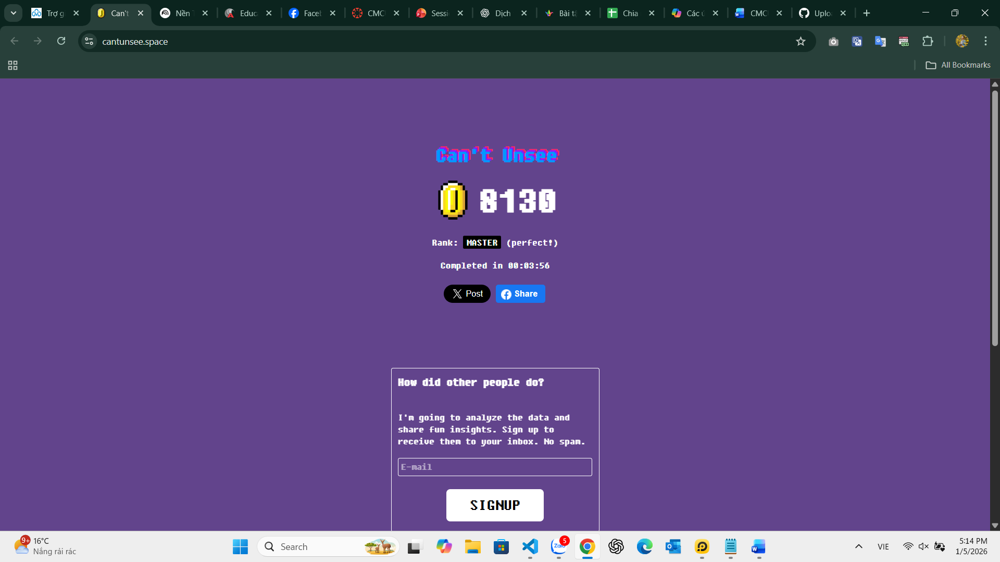

# BÁO CÁO BÀI TẬP MÔN KIỂM THỬ PHẦN MỀM

---

## I. Giới thiệu chung

Repository này được sử dụng để **lưu trữ báo cáo, mã nguồn và minh chứng** cho toàn bộ các bài tập thực hành của môn **Kiểm thử phần mềm**.

Nội dung báo cáo bao gồm nhiều hình thức kiểm thử khác nhau như:

* Kiểm thử thị giác (Visual Testing)
* Kiểm thử tự động End-to-End (E2E Testing)
* Kiểm thử đơn vị (Unit Testing)

---

## II. Thông tin sinh viên

* **Họ và tên:** Nguyễn Dương Sâm
* **Mã sinh viên:** BIT230359
* **Lớp:** SOFT5
* **Môn học:** Kiểm thử phần mềm

---

## III. Bài tập 1 – Kiểm thử thị giác (Visual Testing)

### 1. Tên bài tập

Kiểm thử thị giác website CantUnsee

### 2. Công cụ sử dụng

* Website: [https://cantunsee.space/](https://cantunsee.space/)

### 3. Mục tiêu

Bài tập nhằm rèn luyện khả năng quan sát, so sánh giao diện người dùng (UI) và phát hiện các khác biệt nhỏ trong thiết kế giao diện, từ đó nâng cao kỹ năng kiểm thử phần mềm và sự chú ý đến chi tiết.

### 4. Quy trình thực hiện

* Truy cập website CantUnsee.
* Thực hiện đầy đủ các bài kiểm thử so sánh giao diện theo yêu cầu của hệ thống.
* Ghi nhận kết quả và điểm số sau khi hoàn thành.
* Chụp ảnh màn hình làm minh chứng cho quá trình và kết quả thực hiện.

### 5. Kết quả

* Bài kiểm thử được hoàn thành đầy đủ.
* Kết quả và điểm số đạt được đúng theo yêu cầu đề bài.
* Minh chứng được lưu trữ đầy đủ trong repository.

### 6. Minh chứng

* Ảnh chụp kết quả cuối cùng:  
  

### 7. Kết luận

Thông qua bài tập này, em đã nâng cao khả năng phát hiện lỗi giao diện, hiểu rõ hơn tầm quan trọng của kiểm thử thị giác trong việc đảm bảo chất lượng trải nghiệm người dùng.

---

## IV. Bài tập 2 – Kiểm thử đơn vị (Unit Test với JUnit)

### 1. Tên bài tập

Student Analyzer – Unit Test với JUnit 5

### 2. Công nghệ sử dụng

* Ngôn ngữ: Java
* Framework kiểm thử: JUnit 5
* IDE: Visual Studio Code

### 3. Mô tả bài toán

Xây dựng chương trình phân tích điểm số học sinh và kiểm thử các chức năng xử lý dữ liệu bằng Unit Test.

### 4. Các chức năng được kiểm thử

* Đếm số học sinh đạt loại Giỏi (điểm >= 8.0).
* Tính điểm trung bình hợp lệ trong khoảng từ 0 đến 10.

### 5. Cách thực hiện kiểm thử

* Mở project bằng Visual Studio Code.
* Mở file `StudentAnalyzerTest.java`.
* Chạy kiểm thử bằng chức năng **Run Test** của JUnit.

### 6. Kết quả

* Các test case chạy thành công.
* Chương trình hoạt động đúng theo yêu cầu đề bài.

### 7. Kết luận

Bài tập giúp em hiểu rõ hơn về kiểm thử đơn vị, cách xây dựng test case và vai trò của Unit Test trong việc đảm bảo chất lượng mã nguồn.

---

## V. Bài tập 3 – Kiểm thử tự động End-to-End với Cypress

### 1. Tên bài tập

Kiểm thử End-to-End website Saucedemo bằng Cypress

### 2. Công cụ và công nghệ

* Node.js
* Cypress
* Visual Studio Code
* Website kiểm thử: [https://www.saucedemo.com](https://www.saucedemo.com)

### 3. Mục tiêu

* Làm quen với kiểm thử tự động End-to-End.
* Tự động hóa các kịch bản kiểm thử phổ biến của một website thương mại điện tử.
* Hiểu cách mô phỏng hành vi người dùng thực tế.

### 4. Các kịch bản kiểm thử

#### 4.1 Kiểm thử đăng nhập thành công

* Đăng nhập với tài khoản hợp lệ.
* Xác minh chuyển hướng đến trang danh sách sản phẩm.

#### 4.2 Kiểm thử đăng nhập thất bại

* Đăng nhập với tài khoản không hợp lệ.
* Kiểm tra thông báo lỗi hiển thị.

#### 4.3 Thêm sản phẩm vào giỏ hàng

* Thêm sản phẩm đầu tiên vào giỏ hàng.
* Xác minh số lượng sản phẩm trong giỏ.

#### 4.4 Sắp xếp sản phẩm theo giá

* Chọn bộ lọc "Price (low to high)".
* Xác minh sản phẩm có giá thấp nhất hiển thị đầu tiên.

#### 4.5 Xóa sản phẩm khỏi giỏ hàng

* Thêm sản phẩm vào giỏ hàng.
* Thực hiện xóa sản phẩm.
* Kiểm tra giỏ hàng không còn sản phẩm.

#### 4.6 Quy trình thanh toán

* Thêm sản phẩm vào giỏ hàng.
* Điền thông tin thanh toán.
* Xác minh chuyển đến trang xác nhận thanh toán.

### 5. Kết quả

* Tất cả các kịch bản kiểm thử đều chạy thành công.
* Hệ thống hoạt động đúng với các luồng nghiệp vụ chính.

### 6. Minh chứng

* Ảnh chụp màn hình các kết quả chạy Cypress.

**Video E2E Testing – Spec Login**  
https://github.com/user-attachments/assets/2455ea2b-b4f9-4ab7-80b1-0b62087bf74e

**Video E2E Testing – Spec Cart**  
https://github.com/user-attachments/assets/375d578f-fae4-4642-a489-f42fa065277f

### 7. Kết luận

Cypress là công cụ mạnh mẽ cho kiểm thử tự động End-to-End, giúp phát hiện sớm lỗi và giảm chi phí kiểm thử thủ công.

---

## VI. Kết luận chung

Thông qua các bài tập trong học phần Kiểm thử phần mềm, em đã:

* Nắm được nhiều hình thức kiểm thử khác nhau.
* Hiểu rõ vai trò của kiểm thử trong vòng đời phát triển phần mềm.
* Nâng cao kỹ năng sử dụng các công cụ kiểm thử hiện đại.

Báo cáo này sẽ tiếp tục được cập nhật trong suốt quá trình học tập của học phần.
